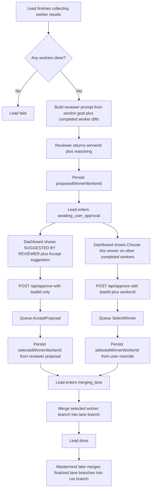
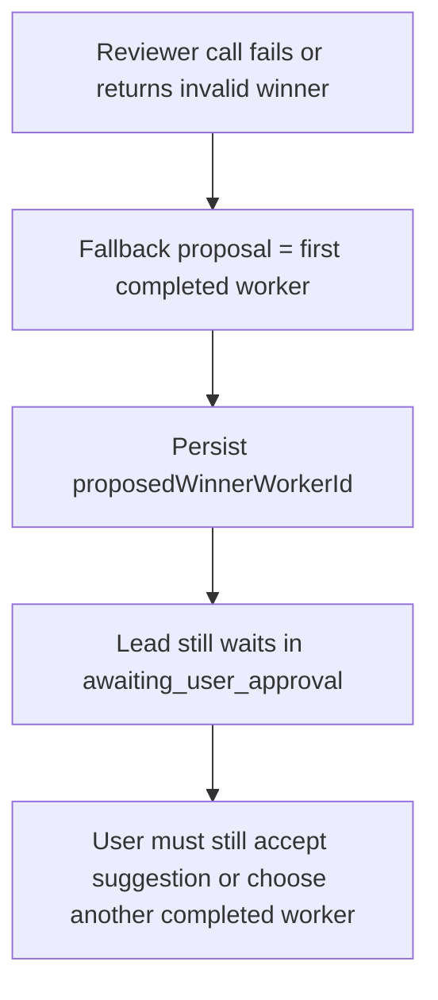

# Reviewer Selection Schema

This schema describes the current shipped reviewer and winner-selection flow in ORC.

## Lane Review Flow

## Authority Boundary

- Reviewer decides `proposedWinnerWorkerId`.
- User decides `selectedWinnerWorkerId`.
- No branch merge happens until a user action selects a winner.
- The selected worker merges into the lane branch first, not directly into the run branch.

## Failure / Fallback Path

